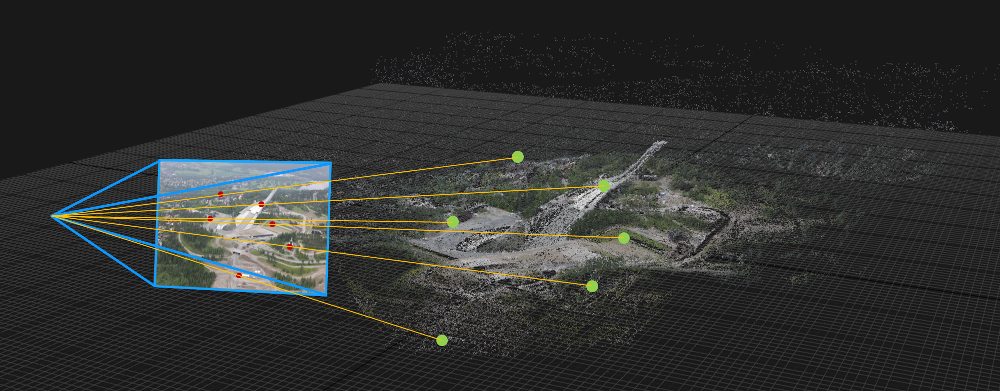

# Lab 6: Pose estimation and Augmented Reality
Welcome to lab 6!

In this lab we will implement pose estimation based on 3D-2D correspondences from scratch!

Start by cloning this repository on your machine.
Then open the lab project in CLion.

The lab is carried out by following these steps:
1. [Get an overview](lab-guide/1-get-an-overview.md)
2. [Camera calibration](lab-guide/2-camera-calibration.md)
3. [Implement homography-based pose estimation](lab-guide/3-implement-homography-based-pose-estimation.md)
4. [Implement Motion-only Bundle Adjustment](lab-guide/4-implement-motion-only-bundle-adjustment.md)

At an appropriate time, [our proposed solution](https://github.com/tek5030/lab_06_solution) will be made available.

Please start the lab by going to the [first step](lab-guide/1-get-an-overview.md).