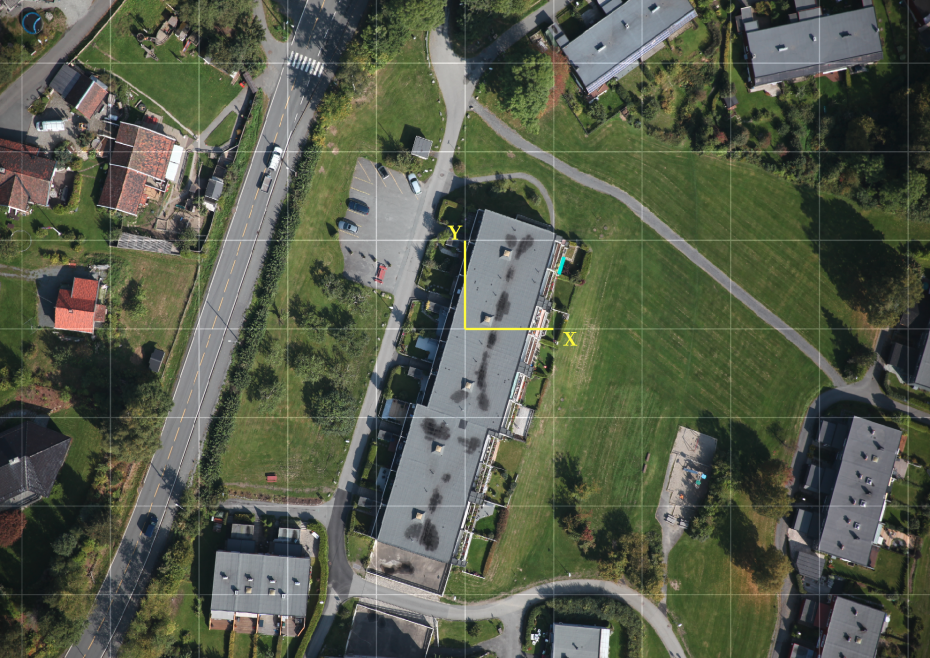

# Step 1: Get an overview
We will start by presenting an overview of the lab and the contents of this project.

## Lab overview
We are given this 2D world map:

The main steps in today's lab are:
- Calibrate the camera (to save time, we will use calibration results computed in advance).
- Create a planar 3D world model from the map with point descriptors.
- Estimate the camera pose from 3D-2D correspondences:
  - Homography-based
  - Motion-only Bundle Adjustment (moba)
- Visualize the 3D world frame in the camera views with Augmented Reality (AR).
- Visualize the camera and world model in 3D.

## Introduction to the project source files
We have chosen to distribute the code on the following files:
- *main.cpp*   
  Starts lab 6, catches any exceptions and prints their error message on the console.

- *lab_6.h*, *lab_6.cpp*   
  Runs the lab 6 loop.

- *ar_example.h*, *ar_example.cpp*   
  Visualizes the world frame in the image frames given the estimated camera pose.

- *camera_projection_measurement.h*, *camera_projection_measurement.cpp*   
  Represents a camera projection of a world point, given in normalized image coordinates.
  You will be responsible for implementing most of the computations in this class.

- *feature_utils.h*, *feature_utils.cpp*   
  Utility functions for feature matching (see [lab 4](https://github.com/tek5030/lab_04)).

- *homography_pose_estimator.h*, *homography_pose_estimator.cpp*   
  Implements homography-based pose estimation for a calibrated camera and planar world points.
  You will be responsible for finishing this estimator.

- *moba_pose_estimator.h*, *moba_pose_estimator.cpp*   
  Iterative non-linear pose estimator for calibrated camera with 3D-2D correspondences.

- *plane_world_model.h*, *plane_world_model.cpp*   
  Represents a planar world in 3D.
  Finds 3D-2D correspondences between the world map and camera images using feature matching.

- *pnp_pose_estimator.h*, *pnp_pose_estimator.cpp*   
  PnP-based pose estimator for calibrated camera with 3D-2D correspondences.
  Can be used as an alternative to `HomographyPoseEstimator`.

- *pose_estimator.h*   
  Defines an abstract interface for 3D-2D pose estimators.

- *scene_3d.h*, *scene_3d.cpp*   
  Visualizes the result in 3D.

Other files we will use:
- *calibSettings.xml*   
  Parameter file for calibrating a camera (can be used when calibrating your own camera).

- *cameraParameters.xml*   
  Camera calibration result for the Microsoft cameras in the lab.

- *world_A3.png*   
  Planar world for printouts on A3 paper (we will use this in the lab).

- *world_A4.png*   
  Planar world for printouts on A4 paper.

Please continue to the [next step](2-camera-calibration.md) to get started!
