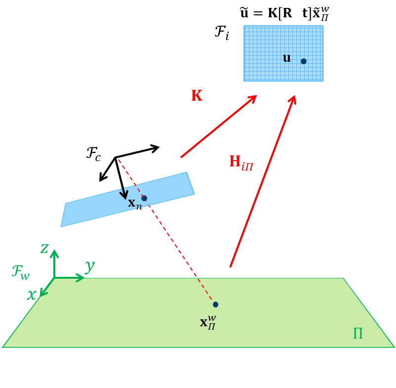
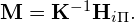
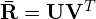

# Step 3: Implement homography-based pose estimation
We will in this part follow the slides in [lecture 6.1](https://www.uio.no/studier/emner/matnat/its/TEK5030/v20/forelesninger/lecture_6_1_pose-estimation.pdf), to finish the class `HomographyPoseEstimator`.

First, take a look at the definition and documentation in [homography_pose_estimator.h](https://github.com/tek5030/lab_06/blob/master/homography_pose_estimator.h). 
Then go to [homography_pose_estimator.cpp](https://github.com/tek5030/lab_06/blob/master/homography_pose_estimator.cpp). 
Read through the code to get an overview. 
Study `HomographyPoseEstimator::estimate()`, and try to understand what is happening here.

Your task is now to implement homography-based pose estimation by performing the necessary computations given in the lecture.

## 2. Compute the **M** matrix
Compute the matrix

## 3. Compute the first two columns of the **R** matrix
Compute the matrix

Tip: See the example here:   
https://eigen.tuxfamily.org/dox/classEigen_1_1JacobiSVD.html.

## 4. Construct the complete **R** matrix
Complete the **R** matrix by computing the last column, taking the cross product between the first two.
Make sure that det(**R**) = 1.

## 5. Compute the scale *&lambda;*
Compute the scale according to

  
## 6. Find the correct solution
Use *&lambda;* and **M** to compute the translation up to the correct sign.

We can check if we have the correct solution by testing the last element of **t**.
Why?

Choose the other solution if this check fails.

You should now be able to compile, run and test the pose estimator. 
You will definitely want to run the program in *Release* when you are finished debugging.

Continue to the [next step](4-implement-motion-only-bundle-adjustment.md) when you are finished testing.
